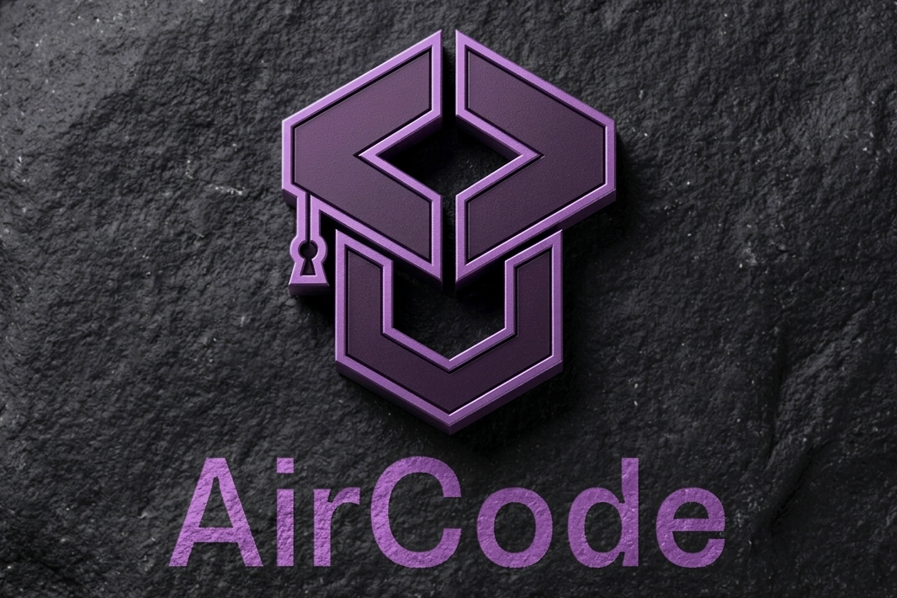

<p align="center">
  
</p>

<h1 align="center">AirCode</h1>
<p align="center">
  A lightweight offline coding environment. Download once, learn anywhere, no Wi-Fi required.
</p>

<p align="center">
  <a href="https://helen-getachew.github.io/AirCode/">🌐 Live Demo</a>
</p>

---

## About

AirCode is a Progressive Web App that teaches students to code entirely offline. You download it once, and from then on it works with zero internet connection — lessons, a live code editor, and code execution all run locally in the browser.

It was built for students in low-resource environments, places with unreliable or no internet access, where most coding education platforms simply don't work. Most tools assume a constant connection. AirCode doesn't.

## Why

I taught myself to code without a reliable internet connection, and later watched classmates hit the same wall: platforms that wouldn't load without a steady connection, no way to download lessons for later, and progress lost the moment a connection dropped. AirCode is my attempt at a coding education tool that doesn't assume the internet is always there.

## Features

-  **Fully offline after first load** — Service Workers and the Cache API cache all lesson content and assets, no server calls required
-  **Tracing Assistant** — before running code, students predict what it will output, then compare their prediction to the real result. It's a self-taught debugging habit, built into the app: trace it yourself before checking the answer
-  **Progressive hints** — challenge hints reveal one at a time, vague to specific, without an internet-dependent AI model
-  **Multi-language editor** — HTML, CSS, and JavaScript run in a sandboxed iframe; Python runs via Skulpt, entirely client-side
-  **Streaks, levels, and trace accuracy** — lightweight local progress tracking to keep students motivated, no account required to work
-  **Local accounts** — sign up with email, or optionally with Google when online; progress is saved per-account in IndexedDB and persists across sessions
- **Installable PWA** — add to home screen on low-end Android devices, or share via USB / local network in classrooms with no internet infrastructure at all

## Tech Stack

- Vanilla JavaScript, HTML, CSS — no framework, kept intentionally lightweight
- Service Workers + Cache API — offline capability
- IndexedDB — local storage for accounts, progress, and stats
- [Skulpt](https://skulpt.org/) — in-browser Python execution
- PWA manifest — installable on Android via Trusted Web Activity

## Running Locally

```bash
git clone https://github.com/helen-getachew/AirCode.git
cd AirCode
# Serve with any static file server, e.g.:
npx serve .
```

Then open the local URL in your browser. To test offline mode: load the page once with a connection, wait a few seconds for the service worker to install, then disable your network and reload.

## Project Status

Built for the Girls in STEM Global Hackathon. Currently piloting with a group of students I've been personally teaching to code, with plans to publish to the Google Play Store and expand to students in Ethiopia and other regions where connectivity is the real barrier to learning.

## Acknowledgements

- [Skulpt](https://skulpt.org/) for offline Python execution in the browser
